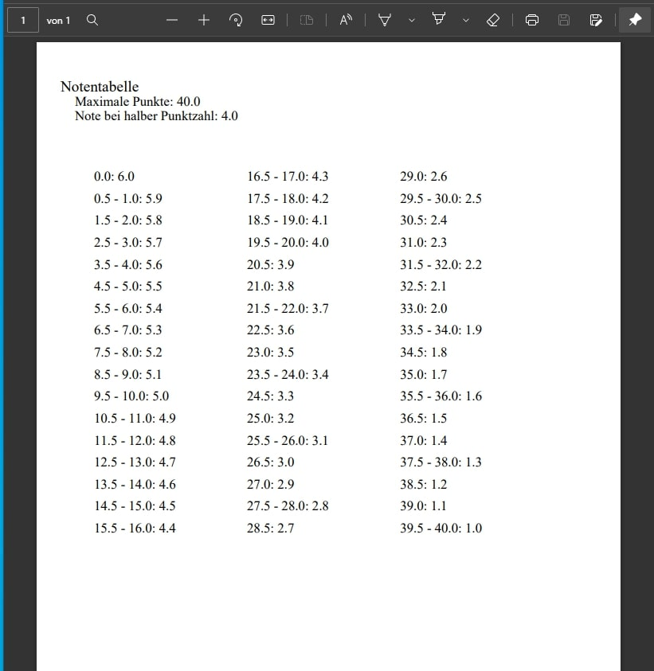

# Notenschlüssel Creator [outdated]

Ein kleines Script, welches Notenskalen für Lehrer erstellt. Jeder Test, jede Arbeit hat unterschiedlich viele Punkte und jede weiterführende Schule verlangt eine andere Gewichtung. So ist es notwendig, dass Notenskalen dynmisch generiert werden müssen. Statt diese Skalen mühsam per Hand oder programmatorisch in Excel zu basteln, erledigt dieses Script es anhand ein paar einfacher Inputs. Die fertige Notenskala wird dann als PDF exportiert.

## verwedente Technologien
- pdfbox

## Screenshots

